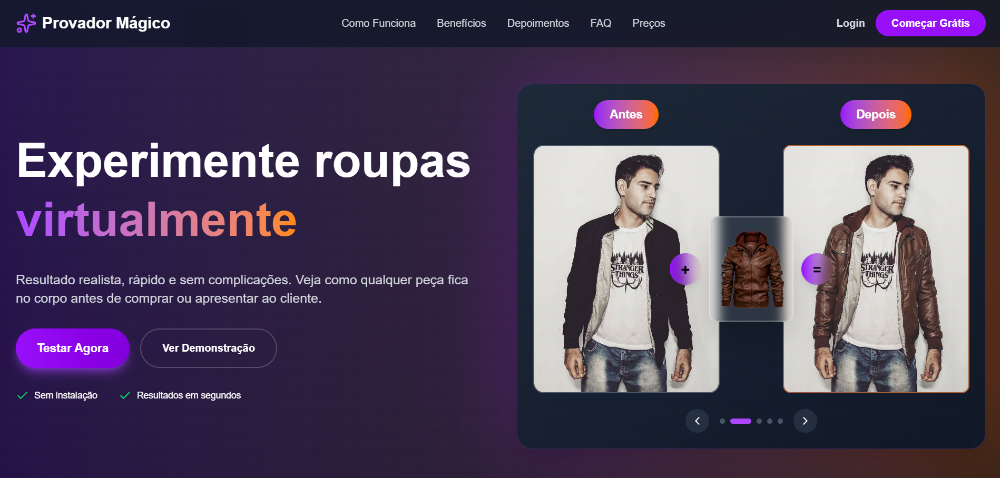
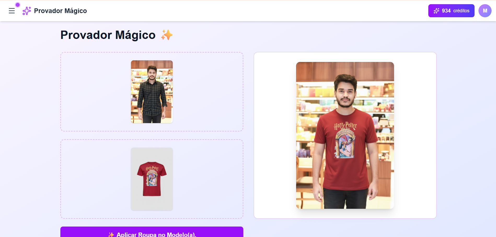

# ✨ Provador Mágico

> Experimente roupas virtualmente com inteligência artificial e monte seu guarda-roupa digital!


## 🎯 Sobre o Projeto

O **Provador Mágico** é uma plataforma inovadora que permite experimentar roupas virtualmente usando tecnologia de IA. Faça testes de looks, modele peças e organize seu guarda-roupa digital de forma prática e divertida!

## 🚀 Funcionalidades

- 👤 **Cadastro e Login Seguro** - Crie sua conta e acesse de qualquer lugar
- 🎁 **10 Créditos Gratuitos** - Teste a plataforma sem custo ao se cadastrar
- 👗 **Prova Virtual** - Experimente roupas usando IA sem sair de casa
- 🎨 **Modelagem de Roupas** - Personalize e visualize diferentes combinações
- 👤 **Padronização de Cliente** - Crie e salve seu modelo virtual personalizado
- 💾 **Guarda-Roupa Digital** - Salve suas peças favoritas e organize coleções
- ⭐ **Favoritos** - Marque seus looks preferidos para acesso rápido

## 🎮 Como Usar

### 1️⃣ Cadastro
1. Acesse a plataforma
2. Clique em **"Cadastrar"**
3. Preencha seus dados (nome, e-mail e senha)
4. Confirme seu cadastro
5. **Ganhe 5 créditos grátis** automaticamente! 🎉

### 2️⃣ Login
1. Na página inicial, clique em **"Entrar"**
2. Insira seu e-mail e senha
3. Acesse seu painel personalizado

### 3️⃣ Padronizar Cliente
1. Acesse **"Meu Perfil"** ou **"Padronizar Cliente"**
2. Faça upload de fotos suas (frente, lateral)
3. Configure suas preferências de estilo
4. Salve seu modelo virtual padrão
5. Use este modelo para todas as provas futuras!

### 4️⃣ Fazer Prova Virtual
1. No painel principal, clique em **"Provador Mágico"**
2. Use seu modelo padrão ou faça upload de uma nova foto
3. Escolha a peça de roupa que deseja experimentar
4. Aguarde a IA processar (usa 1 crédito)
5. Visualize o resultado e salve se gostar!

### 5️⃣ Modelar Roupas
1. Acesse a seção **"Ajustar Roupa"**
2. Selecione o tipo de peça
3. Escolha cores, estampas e ajustes
4. Veja a prévia em tempo real
5. Salve no seu guarda-roupa digital

### 5️⃣ Gerenciar seu Guarda-Roupa
1. Vá para **"Meu Guarda-Roupa"**
2. Visualize todas as suas peças salvas
3. Organize por categorias (camisas, calças, vestidos, etc.)
4. Crie combinações de looks
5. Exclua itens que não deseja mais

## 💳 Sistema de Créditos

- Ao se cadastrar: **5 créditos gratuitos**
- Cada prova virtual: **1 crédito**
- Modelagem de roupas: **gratuita**
- Salvar no guarda-roupa: **gratuito**
- Compre mais créditos na seção **"Créditos"**

## 🛠️ Tecnologias Utilizadas

- React.js
- JavaScript/TypeScript
- CSS3 / Styled Components
- API de IA para prova virtual
- Axios para requisições HTTP
- React Router para navegação

## 📋 Pré-requisitos

- Node.js (versão 14 ou superior)
- NPM ou Yarn
- Navegador web moderno


A aplicação estará disponível em `http://localhost:3000`

## 🌐 Deploy

```bash
# Build para produção
npm run build
# ou
yarn build
```

## 📱 Screenshots

   ### Tela Inicial
   

   ### Dashboard após login
   

   ### Provador Virtual
   

   ### Modelar Roupa
   

## 🤝 Contribuindo

Contribuições são sempre bem-vindas!

1. Faça um Fork do projeto
2. Crie uma branch para sua feature (`git checkout -b feature/NovaFuncionalidade`)
3. Commit suas mudanças (`git commit -m 'Adiciona nova funcionalidade'`)
4. Push para a branch (`git push origin feature/NovaFuncionalidade`)
5. Abra um Pull Request


## 👥 Autores

- **Macelo Akexandre Bezerra Viana** - *Desenvolvimento* - [Seu GitHub](https://github.com/MaceloAlexandre)


---

⭐ Se este projeto te ajudou, considere dar uma estrela no repositório!